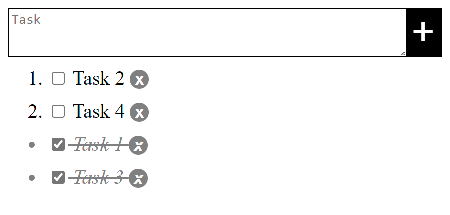
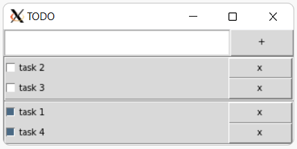

# TODO with Kipu database

[Kipu database](https://github.com/MuchikNet/kipu-database)

## Database schema

```
/todo
    /desc-id := text
    /ok-id   := 1 | DELETE
```

## Languages

|  |  |  |
|:--:|:--:|:--:|
||||
|[JavaScript](javascript/)|[Python](python/)|[Rust](rust/)|
