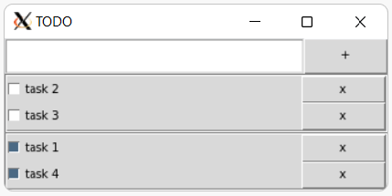

## TODO - Python3



```bash
cd python

python3 main.py
```

### Requirements

```bash
pip3 install -r requirements.txt
```

For `debian-linux` with Tkinter:

```bash
sudo apt install python3-tk
```

For `wsl version 1` with [Xming X Server for Windows](https://sourceforge.net/projects/xming/):

```bash
export DISPLAY=:0
```